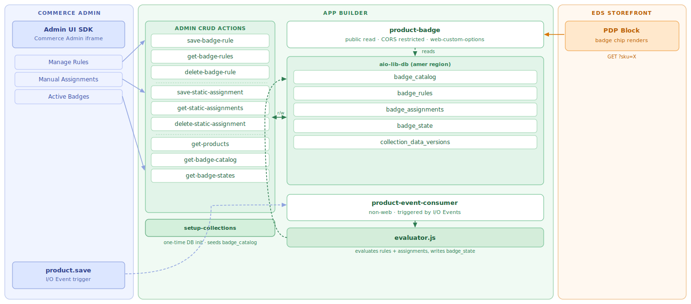

# Badge Manager — Adobe Commerce App Builder Capstone

## Company

**Apex Parts Supply (APS)** is a mid-sized industrial distributor serving manufacturing plants, maintenance teams, and contractors across North America.

APS sells over **10,000 industrial products**, including machinery, hydraulic components, precision tools, and fasteners.

---

## Business Problem

APS frequently runs promotions such as:

- Clearance sales
- Seasonal discounts
- Limited stock offers
- New product launches

Currently, the merchandising team updates prices and sends promotional emails, but many customers never notice these offers.

Most APS customers are procurement or maintenance managers who already know the product they need. They search for a part, open the Product Detail Page (PDP), make a quick decision, and leave. They rarely return to check if a product later goes on sale.

As a result, many promotional opportunities are missed.

---

## Shopper Scenario

A maintenance manager searches for a hydraulic pump.

Unknown to them:

- The product is now **35% off**
- Only **12 units remain** in stock

Because there is no visible indication on the product page, the buyer assumes it is a regular product, decides to purchase later, and eventually buys from another supplier after the stock is gone.

Both the customer and APS lose that opportunity.

---

## Solution — Badge Manager

The Badge Manager highlights important product information directly on the Product Detail Page, where customers make their buying decisions.

Examples include: Clearance, New Arrival, Limited Stock, Staff Pick, Exclusive.

Merchants configure badge rules once, for example:

- Discount >= 30% → Clearance
- Product updated within last 24 hours → New Arrival

Whenever a product is saved, the application automatically evaluates these rules and assigns the appropriate badge. For special business cases, merchants can also manually assign badges to specific products.

---

## Business Benefits

This solution helps APS:

- Sell clearance inventory faster
- Improve conversion of promotional products
- Increase customer engagement on Product Detail Pages
- Reduce customer questions such as "Is this item still on sale?"
- Provide a better shopping experience by surfacing important information at the right moment

Instead of relying on customers to read emails or marketing campaigns, the product itself communicates its most important information exactly when the customer is making a purchase decision.

---

## Architecture



---

## Runtime Actions

### Admin CRUD Actions

Called by the Admin UI SDK. These actions read and write badge configuration in aio-lib-db.

| Action | Method | Description |
|---|---|---|
| `save-badge-rule` | POST | Creates a new badge rule in badge_rules collection |
| `get-badge-rules` | GET | Returns all rules sorted by priority ascending |
| `delete-badge-rule` | POST | Deletes a badge rule by `_id` |
| `save-static-assignment` | POST | Upserts a manual badge assignment for a SKU; returns 201 on create, 200 on update |
| `get-static-assignments` | GET | Returns all manual badge assignments |
| `delete-static-assignment` | POST | Deletes a manual assignment by `_id` |
| `get-products` | GET | Proxies Commerce REST to return SKU and name list for Admin UI dropdowns |
| `get-badge-catalog` | GET | Returns all badge definitions from badge_catalog |
| `get-badge-states` | GET | Returns all evaluated badge state records sorted by evaluated_at descending |

### Storefront Read

| Action | Method | Description |
|---|---|---|
| `product-badge` | GET | Reads badge_state for a SKU and resolves the badge label. CORS restricted via `web-custom-options` to storefront domains and localhost only |

### Event Processing

| Action | Type | Description |
|---|---|---|
| `product-event-consumer` | non-web | Triggered on `catalog_product_save_after`. Evaluates all badge rules via evaluator.js in priority order, falls back to static assignment, and writes the result to badge_state |

### One-time Setup

| Action | Method | Description |
|---|---|---|
| `setup-collections` | GET | Creates all 5 DB collections and seeds badge_catalog with 10 badge definitions. Safe to re-run as it is idempotent |

---

## API Contract: product-badge

**Request**
```
GET /api/v1/web/capstone-appbuilder/product-badge?sku={SKU}
Origin: https://main--dpcom-storefront--dpadobe.aem.live
```

**Success (badge found)**
```json
{
  "status": "ok",
  "sku": "APS-4848",
  "badge_id": "hot_deal",
  "badge_label": "Hot Deal",
  "source": "rule",
  "evaluated_at": "2026-06-25T07:00:00Z"
}
```

**Success (no badge)**
```json
{
  "status": "ok",
  "sku": "APS-4848",
  "badge_id": null,
  "badge_label": null
}
```

**Error**
```json
{
  "status": "error",
  "message": "Missing required param: sku"
}
```

Auth: none required. CORS restricted to storefront domains and localhost.

---

## Setup

### Prerequisites

- Node.js 22+
- Adobe I/O CLI: `npm install -g @adobe/aio-cli`
- Access to the CommerceCohort Adobe I/O org
- Adobe Commerce sandbox credentials

### Clone the repositories

```bash
git clone https://github.com/dpadobe/capstone-appbuilder.git
git clone https://github.com/dpadobe/dpcom-storefront.git
```

### Environment setup

Create a `.env` file in the `capstone-appbuilder` project root. This file is in `.gitignore` and must never be committed.

```bash
# IMS Server-to-Server credentials (from Adobe Developer Console)
IMS_OAUTH_S2S_CLIENT_ID=
IMS_OAUTH_S2S_CLIENT_SECRET=
IMS_OAUTH_S2S_ORG_ID=
IMS_OAUTH_S2S_SCOPES=
IMS_TOKEN_URL=https://ims-na1.adobelogin.com/ims/token/v2

# Adobe Commerce sandbox
COMMERCE_API_BASE_URL=https://na1-sandbox.api.commerce.adobe.com/Cbnoq3LcLn8mELc68EGGzy
COMMERCE_STORE_CODE=default
```

### Deploy

```bash
aio login

# When prompted, select:
# Org:       CommerceCohort
# Project:   DP ACCS TRIAL 2
# Workspace: Capston

aio app deploy
```

First time only, run setup-collections to initialise the database:

```
GET https://3967933-dpcomoope2-capston.adobeio-static.net/api/v1/web/capstone-appbuilder/setup-collections
```

---

## Micro API Architecture and Independent Deployability

Each action is a single-responsibility unit with its own function, inputs, and annotations. You can deploy any one action independently without touching the rest of the application.

```bash
# Deploy a single action (replace product-badge with any action name you want to deploy)
# This ensures micro API architecture and independent action deployment
aio app deploy -a product-badge --no-web-assets

# Deploy only the Admin UI extension without rebuilding actions
aio app deploy -e commerce/backend-ui/1 --no-actions

# Full deploy when app.config.yaml or extension registration changes
aio app deploy

# Tail logs from a specific action
aio app logs -a product-event-consumer -l 10

# List recent activations
aio runtime activation list

# Get full details of a specific activation
aio runtime activation get <activation-id>

# Manually invoke a non-web action with a test payload (runs the deployed action in the cloud)
# Edit test/badge-event-test.json to change the SKU or event_id before running
# Change event_id each time to bypass the idempotency check and force a fresh evaluation
aio runtime action invoke capstone-appbuilder/product-event-consumer --param-file test/badge-event-test.json --result
```

---

## Demo Path

### Step 1: Open Badge Manager in Commerce Admin

Navigate to Commerce Admin:
```
https://na1-sandbox.admin.commerce.adobe.com/Cbnoq3LcLn8mELc68EGGzy/admin/
```
Go to **Apps > Badge Manager > Badge Admin**. This panel only appears if the Badge Manager app is installed via App Management in Commerce Admin.

### Step 2: Create a badge rule

In the **Manage Rules** tab, fill in the form:

- Rule name: Clearance Sale
- Priority: 1
- Condition: Discount >= 30%
- Badge: Clearance

Click **Save Rule**. Verify the rule appears in the existing rules grid below the form before proceeding.

### Step 3: Add a manual assignment (optional)

In the **Manual Assignments** tab, assign any badge directly to a product SKU. Manual assignments always have a lower priority than rule-based badges. If a matching rule exists for that SKU, the rule badge will take precedence.

### Step 4: Trigger a product save in Commerce Admin

Open any product in Commerce Admin and save it. This fires the `catalog_product_save_after` I/O Event which triggers `product-event-consumer`, evaluates all rules by priority, and writes the result to `badge_state`.

### Step 5: Verify in Developer Console logs

Open [Adobe Developer Console](https://developer.adobe.com/console) and navigate to **CommerceCohort > DP ACCS TRIAL 2 > Capston**.

For action logs: select **App Builder Logs** from the left menu and filter by action name to see output from any runtime action.

For event delivery logs: select **DP Capstone Event** under Events, then open the **Debug Tracing** tab. Each `catalog_product_save_after` delivery appears here with its response code and full payload. A 200 confirms the consumer ran successfully.

### Step 6: Verify the badge on the PDP

The product APS-4848 (Automated Positioning System) already has a badge configured and is a good reference:

```
https://main--dpcom-storefront--dpadobe.aem.live/products/automated-positioning-system/aps-4848
```

For any other product saved in Step 4, navigate to its PDP on the storefront. The badge chip should appear below the product title.

```
https://main--dpcom-storefront--dpadobe.aem.live/products/{product-url-key}
```

---

## Security

### Secrets management

All credentials are stored in `.env` which is excluded from source control via `.gitignore`. IMS Server-to-Server credentials, Commerce API base URL, and store code are never hardcoded in action files.

### CORS on the storefront action

`product-badge` is the only action called directly from the browser. It uses the `web-custom-options: true` annotation which prevents the App Builder runtime from injecting its default `Access-Control-Allow-Origin: *`. The action handles CORS entirely, restricting access to:

- `https://main--dpcom-storefront--dpadobe.aem.live`
- `https://main--dpcom-storefront--dpadobe.aem.page`
- `http://localhost:3000` (local development)

### IMS Server-to-Server for database access

All actions authenticate against `aio-lib-db` using IMS OAuth Server-to-Server credentials. The access token is generated at runtime per invocation and never stored.

### Known limitation: Admin mutation actions

The save and delete actions (`save-badge-rule`, `delete-badge-rule`, `save-static-assignment`, `delete-static-assignment`) are currently `require-adobe-auth: false`. IMS token passing was attempted through `App.js` with `require-adobe-auth: true` enabled on these actions, however it did not work as expected. This is work in progress.

---

## Repositories

- App Builder: https://github.com/dpadobe/capstone-appbuilder
- EDS Storefront: https://github.com/dpadobe/dpcom-storefront
